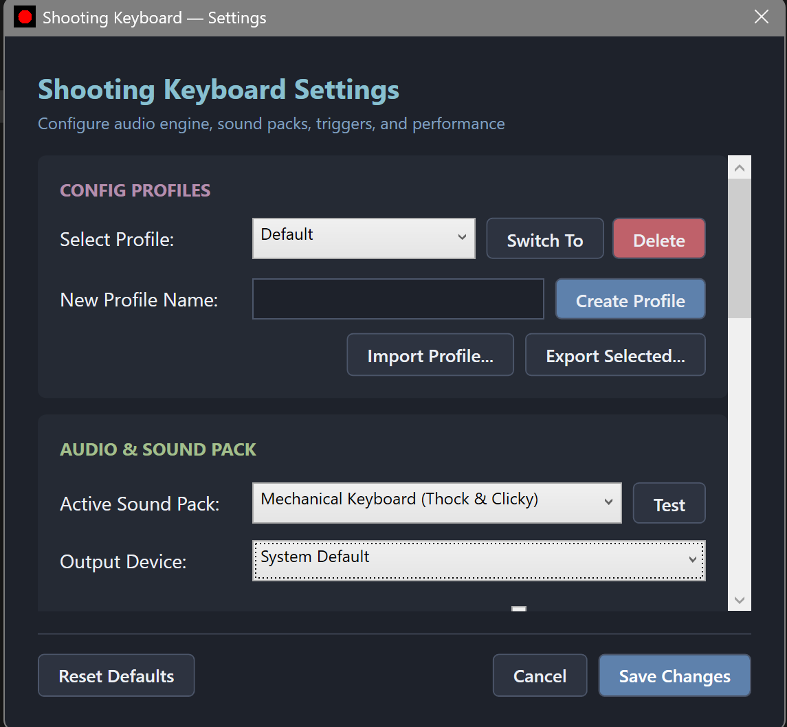

# Shooting Keyboard 🔫💥

**Shooting Keyboard** is a high-performance Windows desktop application built with C# (.NET 8 WPF) and NAudio that plays customizable audio effects (gunshots, sci-fi lasers, retro 8-bit chiptunes, explosions) for every keystroke system-wide with imperceptible audio latency (<15ms).

<p align="center">
  
</p>

<p align="center">
  <a href="https://github.com/sunnydev07/ShootingKeyboard/releases/latest"></a>
  <a href="https://dotnet.microsoft.com/download/dotnet/8.0"></a>
  <a href="https://github.com/sunnydev07/ShootingKeyboard/blob/main/LICENSE"></a>
  <a href="#license"></a>
</p>

---

## Key Features

- **System-Wide Key Interception**: Uses native Win32 low-level keyboard hooks (`WH_KEYBOARD_LL`) running on a dedicated message-pump thread. Intercepts every keystroke in games, IDEs, browsers, and terminal windows without UI lag.
- **Ultra-Low Latency Audio**: NAudio WasapiOut event-driven mixer with pre-cached float PCM memory buffers.
- **3 Bundled Sound Packs**:
  - 💥 **Warzone**: Assault rifles, heavy shotguns, tactical bursts, and grenade explosions.
  - ⚡ **Sci-Fi**: Blaster pulses, plasma cannons, phasers, and warp singularity blasts.
  - 🕹️ **Retro Arcade**: 8-bit chiptune key blips, jump effects, coin chimes, and powerups.
- **Combo Multiplier System**: Escalates sound tiers and pitch dynamically during rapid typing streaks.
- **On-Screen Visual Overlay**: Transparent, click-through (`WS_EX_TRANSPARENT | WS_EX_LAYERED`) top-most window displaying key ripples and combo meters.
- **Key Binding Customization**: Custom mappings by logical key groups (WASD, Letters, Space, Enter, Numbers, F-Keys, Arrows) or individual key capture.
- **Sound Pack Manager**: Easily drop custom sound packs into `%AppData%/ShootingKeyboard/packs`.
- **System Tray Background Operation**: Runs silently in the tray with quick toggles (Mute, Pause/Resume, Settings, Exit).
- **Windows Startup Integration**: Registry integration to start automatically on login.
- **Performance Mode**: Strips visual effects and optimizes thread priority for competitive gaming sessions.

---

## Project Structure

```
ShootingKeyboard/
├── ShootingKeyboard.sln
├── src/
│   ├── ShootingKeyboard/                 # Main WPF Application
│   │   ├── Models/                      # AppConfig, SoundPack, KeyEvent, KeyBinding
│   │   ├── Services/                    # KeyboardHook, AudioEngine, SoundPackManager,
│   │   │                                # ComboTracker, OverlayManager, TrayIconManager,
│   │   │                                # StartupManager, BindingResolver, ConfigService
│   │   ├── ViewModels/                  # Main, Settings, KeyBinding, SoundPack ViewModels
│   │   ├── Views/                       # SettingsWindow, KeyBindingWindow, SoundPackWindow
│   │   ├── Overlay/                     # OverlayWindow (transparent top-most visualizer)
│   │   └── Resources/                   # Embedded default sound packs and application icons
│   └── ShootingKeyboard.Tests/           # xUnit Unit & Integration Test Suite
├── sound-packs/                         # Standalone bundled sound packs
│   ├── Warzone/
│   ├── SciFi/
│   └── RetroArcade/
├── installer/                           # WixSharp MSI installer script
├── docs/                                # Sound Pack Format specifications
└── README.md
```

---

## Building and Running Locally

### Prerequisites
- Windows 10 / 11 (64-bit)
- [.NET 8.0 SDK](https://dotnet.microsoft.com/download/dotnet/8.0)

### Build and Test
```powershell
# Restore and build the solution
dotnet build -c Release

# Run the full unit test suite
dotnet test
```

### Run the App
```powershell
dotnet run --project src/ShootingKeyboard/ShootingKeyboard.csproj
```

---

## Creating the Installer

```powershell
# 1. Publish self-contained executable
dotnet publish src/ShootingKeyboard/ShootingKeyboard.csproj -c Release -r win-x64 --self-contained true

# 2. Build MSI using WixSharp script
dotnet-script installer/BuildInstaller.csx
```

---

## Documentation

- 📖 **[User & Installation Guide](docs/USER_GUIDE.md)** — Complete setup walkthrough, tray guide, settings, and FAQs.
- 🎵 **[Sound Pack Format Specification](docs/SOUND_PACK_FORMAT.md)** — Schema and instructions for creating custom sound packs.

---

## License
MIT License
